  

  
  
  

## 🌸 About Me

  

## ⚡ Tech Stack

  

## 🚀 Featured Projects

<table width="100%">
  <tr>
    <th align="left" width="22%">Project</th>
    <th align="left">Description</th>
    <th align="left" width="12%">Stack</th>
  </tr>
  <tr>
    <td>🌀 <a href="https://github.com/Pratik-y-SDE/StormTracker"><b>StormTracker</b></a></td>
    <td>Cyclone detector built at the Code for Community Hackathon, refined over 3 versions</td>
    <td><code>Python</code></td>
  </tr>
  <tr>
    <td>🎓 <a href="https://github.com/Pratik-y-SDE/student-toolkit-python"><b>Student Toolkit</b></a></td>
    <td>GPA calculation, CGPA tracking and interactive quizzes</td>
    <td><code>Python</code></td>
  </tr>
</table>

## 🤝 Open Source Contributions

<table width="100%">
  <tr>
    <th align="left" width="30%">Repository</th>
    <th align="left">Contribution</th>
  </tr>
  <tr>
    <td><a href="https://github.com/TechyCSR/OpenCluely">TechyCSR/OpenCluely</a></td>
    <td>Added Kotlin as a supported coding language (<a href="https://github.com/TechyCSR/OpenCluely/pull/59">PR #59</a>)</td>
  </tr>
  <tr>
    <td><a href="https://github.com/hiteshchoudhary/apihub">hiteshchoudhary/apihub</a></td>
    <td>Fixed case-insensitive search for the quotes, books and YouTube endpoints (<a href="https://github.com/hiteshchoudhary/apihub/pull/357">PR #357</a>)</td>
  </tr>
</table>

## 📊 GitHub Activity

  

  

